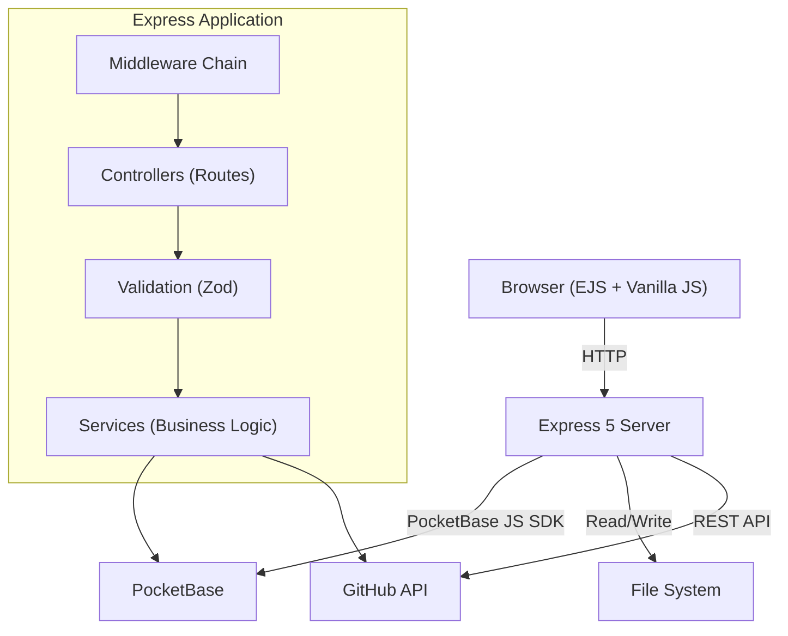
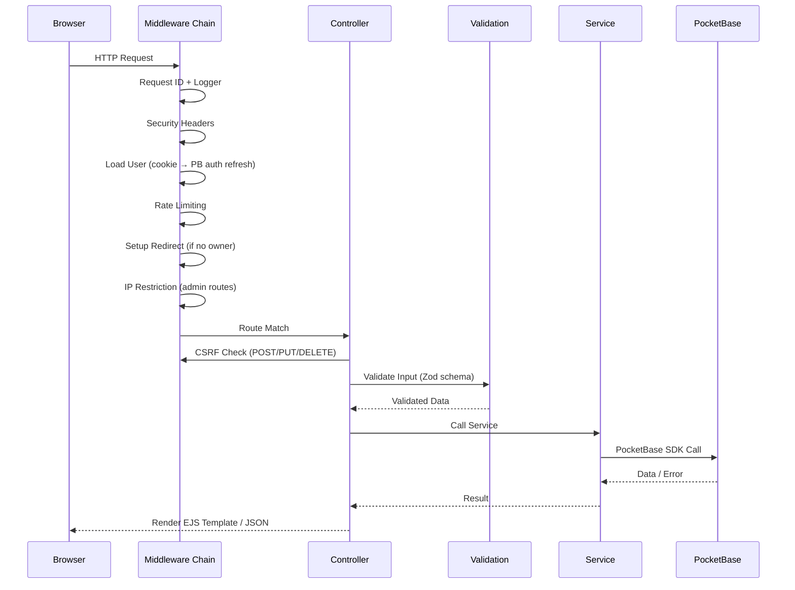
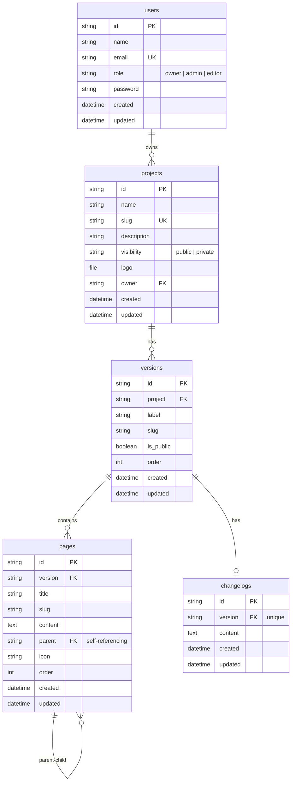
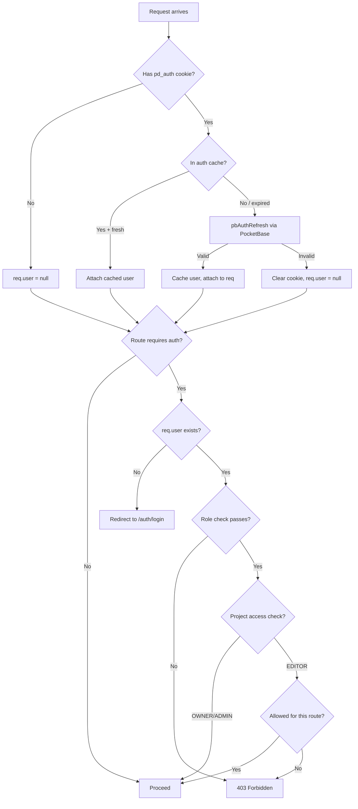
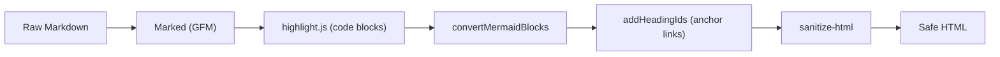

# Architecture Overview

PocketDocs is a server-rendered documentation platform built on Express 5 and PocketBase.

## System Architecture



### Components

| Component | Responsibility |
|-----------|---------------|
| **Express Server** | HTTP handling, routing, template rendering, static file serving |
| **PocketBase** | Persistent storage, user authentication, file uploads, full-text filtering |
| **GitHub API** | Optional integration for importing docs from repositories |
| **File System** | Runtime configuration (`data/`), log files (`logs/`) |

## Request Lifecycle



## Module Architecture

Each feature follows a consistent **Controller → Service → Validation** pattern:

```
src/modules/{feature}/
├── controller.js   # Express router — routes, middleware wiring, response rendering
├── service.js      # Business logic — PocketBase calls, data transformation
└── validation.js   # Zod schemas — input validation for request body/query/params
```

**Separation rules:**
- Controllers never call PocketBase directly
- Services never access `req` / `res`
- Validation schemas are pure data definitions with no side effects

### Module Map

| Module | Purpose | Key Entities |
|--------|---------|-------------|
| `auth` | Login, logout, session management | User credentials, auth cookies |
| `setup` | First-run owner account creation | Owner registration |
| `projects` | CRUD for documentation projects | Project (name, slug, visibility, owner) |
| `versions` | CRUD for project versions | Version (label, slug, order, is_public) |
| `pages` | CRUD for documentation pages, tree ordering | Page (title, slug, content, parent, order) |
| `changelogs` | Per-version changelog management | Changelog (content, created, updated) |
| `users` | User management (owner-only) | User (name, email, role) |
| `settings` | Site settings & IP restriction | Settings JSON, IP restriction rules |
| `public` | Public-facing routes & search API | Read-only access to public data |
| `github` | GitHub integration — repo browsing & doc import | Repos, tags, commits, file trees |

## Database Schema (ER Diagram)



### Key Constraints

- **projects.slug** — unique across all projects
- **(versions.project, versions.slug)** — unique per project
- **(pages.version, pages.slug)** — unique per version
- **changelogs.version** — one changelog per version
- **Cascade deletes** — deleting a project removes all its versions, pages, and changelogs

## Authentication & Authorization



### Role Hierarchy

| Role | Projects | Versions | Pages | Users | Settings |
|------|----------|----------|-------|-------|----------|
| **Owner** | Full CRUD | Full CRUD | Full CRUD | Full CRUD | Full (incl. IP restriction) |
| **Admin** | Full CRUD | Full CRUD | Full CRUD | — | Site settings only |
| **Editor** | Read only | Read only | Edit & reorder | — | — |

## Security Layers

| Layer | Implementation |
|-------|---------------|
| **CSRF** | HMAC-SHA256 double-submit cookie pattern |
| **Rate Limiting** | `express-rate-limit` — separate limits for general and auth routes |
| **Security Headers** | HSTS, CSP, X-Frame-Options DENY, Referrer-Policy, Permissions-Policy |
| **Input Validation** | Zod schemas with max lengths, regex patterns, type coercion |
| **HTML Sanitization** | `sanitize-html` strips unsafe tags/attributes from rendered Markdown |
| **IP Restriction** | Optional allowlist for `/admin` and `/auth` routes |
| **Auth Cookies** | `httpOnly`, `secure` (production), `sameSite: strict` |

## Error Handling

All application errors extend `AppError` (see `src/errors/`). The global error handler (`src/middleware/error-handler.js`) produces:

- **HTML responses** — renders `views/error.ejs` with status code and message
- **JSON responses** — structured `{ error: { code, message, details?, requestId } }`
- **Auth errors** — redirect to `/auth/login`

Error taxonomy (in `src/errors/taxonomy.js`):

| Error Class | HTTP Status | Use Case |
|-------------|-------------|----------|
| `ValidationError` | 400 | Invalid input |
| `AuthenticationError` | 401 | Missing or invalid credentials |
| `AuthorizationError` | 403 | Insufficient permissions |
| `NotFoundError` | 404 | Resource does not exist |
| `ConflictError` | 409 | Duplicate slug, etc. |
| `RateLimitError` | 429 | Too many requests |
| `CsrfError` | 403 | CSRF token mismatch |
| `DomainError` | 422 | Business rule violation |
| `ExternalServiceError` | 502 | GitHub API failure, etc. |
| `InternalError` | 500 | Unexpected server error |

## Markdown Pipeline



The `renderMarkdown` function in `src/lib/markdown.js` produces sanitized HTML with:
- GitHub Flavored Markdown (tables, task lists, strikethrough)
- Syntax-highlighted code blocks
- Mermaid diagram support (fenced `mermaid` code blocks → rendered diagrams)
- Auto-generated heading IDs for table-of-contents linking
- External links open in new tabs with `rel="noopener noreferrer"`

## Logging

Winston logger with:
- **Console transport** — colorized output for development
- **Daily rotate file** — `logs/app-YYYY-MM-DD.log`, 14-day retention, 20 MB max per file
- **Structured JSON** — each log entry includes `timestamp`, `level`, `message`, and `requestId` for tracing
- **Sensitive data masking** — passwords, tokens, and secrets are masked in log output via `src/lib/masking.js`
