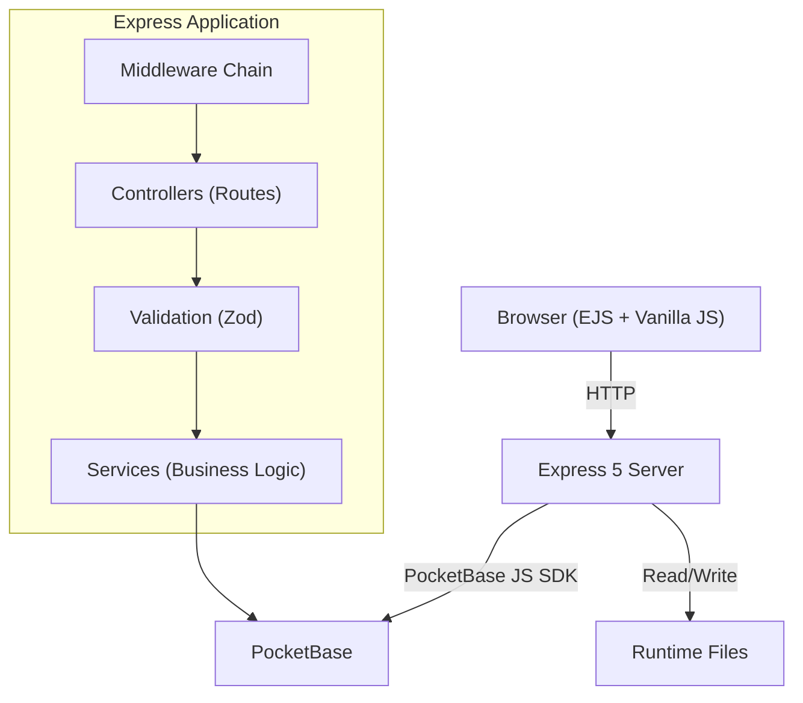
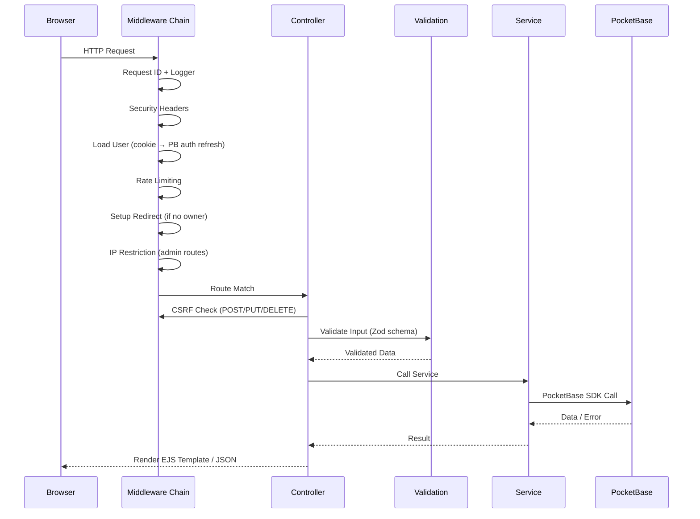
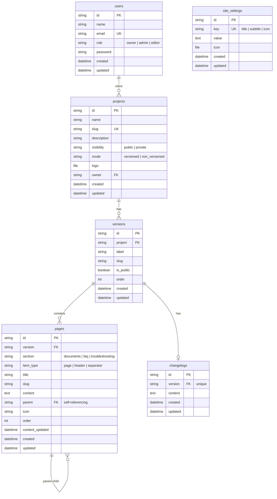
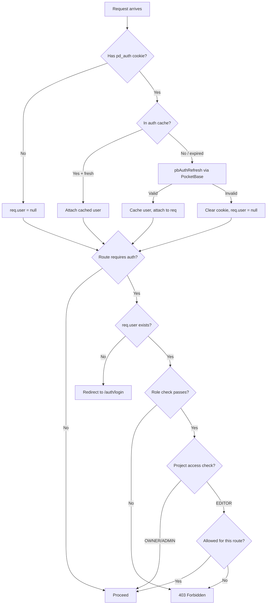
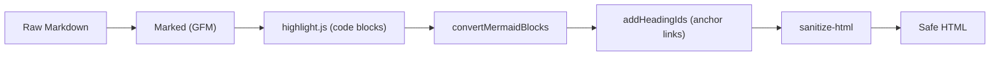

# Architecture Overview

PocketDocs is a server-rendered documentation platform built on Express 5 and PocketBase.

## System Architecture


```mermaid
graph TD
    Browser["Browser (EJS + Vanilla JS)"]
    Express["Express 5 Server"]
    PB["PocketBase"]
    FS["Runtime Files"]

    Browser -->|HTTP| Express
    Express -->|PocketBase JS SDK| PB
    Express -->|Read/Write| FS

    subgraph Express Application
        MW["Middleware Chain"]
        Ctrl["Controllers (Routes)"]
        Svc["Services (Business Logic)"]
        Val["Validation (Zod)"]
    end

    MW --> Ctrl --> Val --> Svc
    Svc --> PB
```

### Components

| Component | Responsibility |
|-----------|---------------|
| **Express Server** | HTTP handling, routing, template rendering, static file serving |
| **PocketBase** | Persistent storage, user authentication, file uploads, full-text filtering |
| **Runtime Files** | IP restriction configuration and embedded PocketBase runtime data under `data/` |

## Request Lifecycle


```mermaid
sequenceDiagram
    participant B as Browser
    participant MW as Middleware Chain
    participant C as Controller
    participant V as Validation
    participant S as Service
    participant PB as PocketBase

    B->>MW: HTTP Request
    MW->>MW: Request ID + Logger
    MW->>MW: Security Headers
    MW->>MW: Load User (cookie → PB auth refresh)
    MW->>MW: Rate Limiting
    MW->>MW: Setup Redirect (if no owner)
    MW->>MW: IP Restriction (admin routes)
    MW->>C: Route Match
    C->>MW: CSRF Check (POST/PUT/DELETE)
    C->>V: Validate Input (Zod schema)
    V-->>C: Validated Data
    C->>S: Call Service
    S->>PB: PocketBase SDK Call
    PB-->>S: Data / Error
    S-->>C: Result
    C-->>B: Render EJS Template / JSON
```

## Module Architecture

Each feature follows a consistent **Controller → Service → Validation** pattern:

```
src/modules/{feature}/
├── controller.js   # Express router — routes, middleware wiring, response rendering
├── service.js      # Business logic — PocketBase calls, data transformation
└── validation.js   # Zod schemas — input validation for request body/query/params
```

**Separation rules:**
- Controllers never call PocketBase directly
- Services never access `req` / `res`
- Validation schemas are pure data definitions with no side effects

### Module Map

| Module | Purpose | Key Entities |
|--------|---------|-------------|
| `auth` | Login, logout, session management | User credentials, auth cookies |
| `setup` | First-run owner account creation | Owner registration |
| `projects` | CRUD for documentation projects and mode-specific flow | Project (name, slug, visibility, mode, owner) |
| `versions` | CRUD for project versions | Version (label, slug, order, is_public) |
| `pages` | CRUD, bulk Markdown import, sidebar navigation, and tree ordering for Documents, FAQ, and Troubleshooting | Page (section, item type, title, slug, content, parent, order) |
| `changelogs` | Per-version changelog management | Changelog (content, created, updated) |
| `users` | User management (owner-only) | User (name, email, role) |
| `settings` | Public branding & IP restriction | PocketBase-backed title/subtitle/icon records, file-backed IP restriction rules |
| `public` | Public-facing routes & search API | Read-only access to public data |

## Public Interface Languages

`src/modules/public/i18n.js` selects the public interface language from the browser's `Accept-Language` header, using Express to respect preference order and quality weights. Unsupported or missing preferences use English. Responses include `Content-Language` and `Vary: Accept-Language` so caches distinguish the selected language.

The catalog in `src/modules/public/translations.json` supports English, Portuguese (Brazil and Portugal), Spanish, French, German, Italian, Russian, Chinese (Simplified and Traditional), Japanese, Korean, Arabic, Hindi, Indonesian, and Turkish. Regional preferences use the corresponding language; `pt` defaults to Brazilian Portuguese, and `zh` defaults to Simplified Chinese. Chinese script subtags take precedence over region, with Taiwan, Hong Kong, and Macao using Traditional Chinese when no script is specified.

Only system messages are passed to the request-scoped `t` view helper. The English source text is the catalog key and the default for untranslated messages. Count messages use `Intl.PluralRules`. Existing frontend scripts receive their labels through escaped `data-*` attributes, and search responses translate only the system section label. Project names, descriptions, version labels, page titles, Markdown, headings, and saved homepage branding remain as authored.

Arabic uses right-to-left navigation, including the mobile sidebar gesture. Authored content determines its own text direction. Public date formatting uses the selected locale through the existing view helpers, without changing stored timestamps or timezone behavior. `/admin`, `/auth`, and `/setup` retain the English interface, including shared error views and scripts.

When adding a public message, pass its English source text to `t` and add the matching key to every translated locale. English only needs catalog entries for plural forms. Keep custom content out of `t`.

## Database Schema (ER Diagram)


```mermaid
erDiagram
    users {
        string id PK
        string name
        string email UK
        string role "owner | admin | editor"
        string password
        datetime created
        datetime updated
    }

    projects {
        string id PK
        string name
        string slug UK
        string description
        string visibility "public | private"
        string mode "versioned | non_versioned"
        file logo
        string owner FK
        datetime created
        datetime updated
    }

    versions {
        string id PK
        string project FK
        string label
        string slug
        boolean is_public
        int order
        datetime created
        datetime updated
    }

    pages {
        string id PK
        string version FK
        string section "documents | faq | troubleshooting"
        string item_type "page | header | separator"
        string title
        string slug
        text content
        string parent FK "self-referencing"
        string icon
        int order
        datetime content_updated
        datetime created
        datetime updated
    }

    changelogs {
        string id PK
        string version FK "unique"
        text content
        datetime created
        datetime updated
    }

    site_settings {
        string id PK
        string key UK "title | subtitle | icon"
        text value
        file icon
        datetime created
        datetime updated
    }

    users ||--o{ projects : "owns"
    projects ||--o{ versions : "has"
    versions ||--o{ pages : "contains"
    versions ||--o| changelogs : "has"
    pages ||--o{ pages : "parent-child"
```

### Key Constraints

- **projects.slug** — unique across all projects
- **(versions.project, versions.slug)** — unique per project
- **(pages.version, pages.section, pages.slug)** — unique per version section
- **changelogs.version** — one changelog per version
- **site_settings.key** — one record per site setting
- **Cascade deletes** — deleting a project removes all its versions, pages, and changelogs

## Authentication & Authorization


```mermaid
flowchart TD
    A[Request arrives] --> B{Has pd_auth cookie?}
    B -->|No| C[req.user = null]
    B -->|Yes| D{In auth cache?}
    D -->|Yes + fresh| E[Attach cached user]
    D -->|No / expired| F[pbAuthRefresh via PocketBase]
    F -->|Valid| G[Cache user, attach to req]
    F -->|Invalid| H[Clear cookie, req.user = null]

    E --> I{Route requires auth?}
    G --> I
    C --> I
    H --> I

    I -->|No| J[Proceed]
    I -->|Yes| K{req.user exists?}
    K -->|No| L[Redirect to /auth/login]
    K -->|Yes| M{Role check passes?}
    M -->|No| N[403 Forbidden]
    M -->|Yes| O{Project access check?}
    O -->|OWNER/ADMIN| J
    O -->|EDITOR| P{Allowed for this route?}
    P -->|Yes| J
    P -->|No| N
```

### Role Hierarchy

| Role | Projects | Versions | Pages | Users | Settings |
|------|----------|----------|-------|-------|----------|
| **Owner** | Full CRUD | Full CRUD | Full CRUD | Full CRUD | Full (incl. IP restriction) |
| **Admin** | Full CRUD | Full CRUD | Full CRUD | — | Site settings only |
| **Editor** | Read only | Read only | Edit & reorder | — | — |

## Security Layers

| Layer | Implementation |
|-------|---------------|
| **CSRF** | HMAC-SHA256 double-submit cookie pattern |
| **Rate Limiting** | `express-rate-limit` — separate limits for general and auth routes |
| **Security Headers** | HSTS, CSP, X-Frame-Options DENY, Referrer-Policy, Permissions-Policy |
| **Input Validation** | Zod schemas with max lengths, regex patterns, type coercion |
| **HTML Sanitization** | `sanitize-html` strips unsafe tags/attributes from rendered Markdown and inline branding Markdown |
| **Site Icon Validation** | Binary signatures are checked and SVG active content, external resources, event handlers, and inline styles are rejected |
| **IP Restriction** | Optional allowlist for `/admin` and `/auth` routes |
| **Auth Cookies** | `httpOnly`, `secure` (production), `sameSite: strict` |

## Error Handling

All application errors extend `AppError` (see `src/errors/`). The global error handler (`src/middleware/error-handler.js`) produces:

- **HTML responses** — renders `views/error.ejs` with status code and message
- **JSON responses** — structured `{ error: { code, message, details?, requestId } }`
- **Auth errors** — redirect to `/auth/login`

Error taxonomy (in `src/errors/taxonomy.js`):

| Error Class | HTTP Status | Use Case |
|-------------|-------------|----------|
| `ValidationError` | 422 | Invalid input |
| `AuthenticationError` | 401 | Missing or invalid credentials |
| `AuthorizationError` | 403 | Insufficient permissions |
| `NotFoundError` | 404 | Resource does not exist |
| `ConflictError` | 409 | Duplicate slug, etc. |
| `CsrfError` | 403 | CSRF token mismatch |
| `InfrastructureError` | 500 | Database or filesystem failure |
| `ExternalServiceError` | 502 | Upstream service failure |

## Markdown Pipeline


```mermaid
flowchart LR
    MD["Raw Markdown"] --> Marked["Marked (GFM)"]
    Marked --> HL["highlight.js (code blocks)"]
    HL --> MER["convertMermaidBlocks"]
    MER --> HID["addHeadingIds (anchor links)"]
    HID --> SAN["sanitize-html"]
    SAN --> HTML["Safe HTML"]
```

The `renderMarkdown` function in `src/lib/markdown.js` produces sanitized HTML with:
- GitHub Flavored Markdown (tables, task lists, strikethrough)
- Syntax-highlighted code blocks
- Mermaid diagram support (fenced `mermaid` code blocks → rendered diagrams)
- Auto-generated heading IDs for table-of-contents linking
- External links open in new tabs with `rel="noopener noreferrer"`

Short branding strings use a separate inline-only pipeline. `renderInlineMarkdown` permits sanitized inline formatting without block elements, images, or raw HTML, while `extractInlineMarkdownText` produces plain text for browser metadata.

## Logging

Winston logger with:
- **Console transport** — colorized output (all environments)
- **Structured format** — each log entry includes `timestamp`, `level`, and `message`; request-scoped entries include `requestId` when provided
- **Sensitive data masking** — passwords, tokens, and secrets are masked in log output via `src/lib/masking.js`
